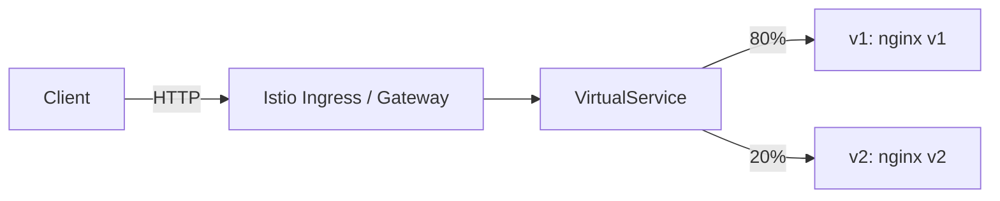
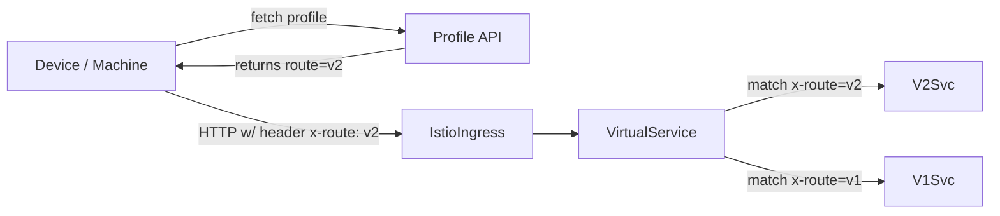
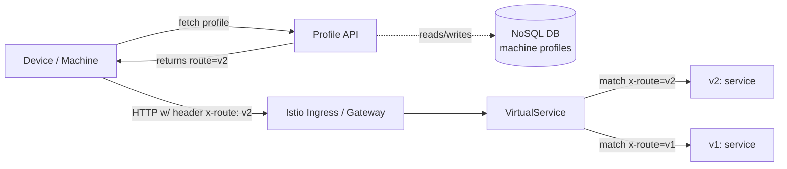

# Gradual Rollout 

---

# Background
- Kubernetes reduces downtime, but production can still reveal bugs and unexpected behavior. 
- Gradual rollout reduces the risk by limiting exposure and reduce blast radius
- Release should be boring

# Different strategies for gradual rollout
- Feature flags (requires app-level support and feature management).
- Cluster-by-cluster rollout (good when you control multiple clusters).
- DNS-based traffic splitting (coarse control via DNS records).
- Service mesh routing (Istio) — flexible, powerful, and the approach covered in these demos.

# Demo Setup (what I used)
- Local Kind cluster with Istio installed.
- Kiali or Kubernetes dashboard for monitoring.
- Demo repos are on GitHub (links in the repo README). You can clone and run them later.
- Scripts and demo codes were generated by AI.  More refactoring and improvements can be made.  They are for demo purpose only and not to be consiered sample codes to use.

---

# Demo 1 — Percentage-based rollout

- Use Istio VirtualService weights to split traffic between v1/v2.
- Ideal for random sampling across global traffic.
- Quick win: change weights to move traffic (e.g., 90/10 → 50/50 → 0/100).

Architecture (simple):

---

# Demo 2 — Location-based rollout
- Problem: small sites can be over- or under-represented in a global random sample.
- Approach: group devices by location and apply percentage per location.
- Use Istio routes by request header.
- Headers set by client-side logic based on device profile.

Example flow diagram:

---

# Real-life: Machine profiles stored in a NoSQL DB
In a production environment, device (machine) profiles are commonly stored in a database (for example a NoSQL DB). The client fetches its profile from the Profile API, which reads/writes the DB. The dashed line in the diagram below indicates the backend DB interaction (not part of the request path to Istio).

---

# Monitoring & Rollback

- Instrument both versions with metrics and logs.
- Watch error rate, latency, and SLOs per location.
- If degradation appears: revert 100% to previous version

---

# Practical tips

- Considerations for timing - your rollout could be slower than before
- Decouple DB schema changes, service chang and frontend changes. (backward compatibility)
- My article about Backward Compatibility: https://medium.com/@frankchen0218/strategies-for-backward-compatible-deployment-in-microservices-architecture-1e6f3f3f4f2c
---
